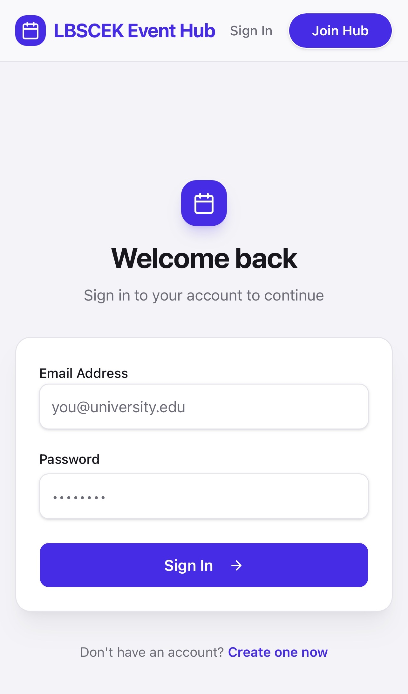

# Campus Event Hub

A modern full-stack event management platform designed for colleges and universities. The platform enables students to discover, register for, and manage campus events while providing administrators with tools to create, organize,optimize and monitor event activities.

## Live Demo

Live Website: https://event-hub--shaheem1771.replit.app

## GitHub Repository

https://github.com/shaheem1771/Event-Hub

---

## Features

### Student Features
- Student Registration & Login
- Browse Upcoming Events
- Search and Filter Events
- Event Registration
- View Registered Events
- Responsive Mobile Experience

### Admin Features
- Secure Admin Authentication
- Create New Events
- Edit & Manage Events
- Monitor Registrations
- Track Event Participation
- Dashboard Overview

### System Features
- Role-Based Authentication
- JWT Authentication
- Secure Password Hashing (bcrypt)
- MongoDB Atlas Integration
- Real-Time Data Management
- Responsive UI Design

---

## Tech Stack

### Frontend
- React
- TypeScript
- Tailwind CSS
- Vite

### Backend
- Node.js
- Express.js

### Database
- MongoDB Atlas
- Mongoose

### Deployment
- Replit

### Version Control
- Git
- GitHub

---
## Screenshots

### Homepage


### Login Page



### Registration Page

[Registration](IMG_2673.jpeg)

---

## Project Structure

```text
.
├── artifacts/
│   ├── api-server/
│   │   ├── src/
│   │   │   ├── app.ts
│   │   │   ├── index.ts
│   │   │   ├── models/
│   │   │   │   ├── user.ts
│   │   │   │   ├── event.ts
│   │   │   │   └── registration.ts
│   │   │   ├── routes/
│   │   │   │   ├── auth.ts
│   │   │   │   ├── events.ts
│   │   │   │   ├── admin.ts
│   │   │   │   ├── students.ts
│   │   │   │   └── health.ts
│   │   │   ├── middlewares/
│   │   │   │   └── auth.ts
│   │   │   └── lib/
│   │   │       ├── mongodb.ts
│   │   │       ├── logger.ts
│   │   │       └── seed.ts
│   │   └── build.mjs
│   │
│   └── college-events/
│       ├── src/
│       │   ├── components/
│       │   ├── pages/
│       │   ├── hooks/
│       │   ├── lib/
│       │   ├── App.tsx
│       │   └── main.tsx
│       └── vite.config.ts
│
├── lib/
│   ├── api-spec/
│   ├── api-client-react/
│   └── api-zod/
│
└── README.md
```

---

## Authentication

The platform supports:

- Student Login
- Student Registration
- Admin Login
- JWT Authentication
- Password Hashing using bcrypt
- Protected Routes.

---

## Installation

```bash
git clone https://github.com/shaheem1771/Event-Hub.git

cd Event-Hub

npm install

npm run dev
```

---

## Future Improvements

- QR Code Event Tickets
- Email Notifications
- Event Waitlist System
- Attendance Tracking
- Certificate Generation
- Event Analytics Dashboard
- Club & Organization Management
- Multi-College Support
- Event Reminder Notifications

---

## Author

**Muhammed Shaheem**

GitHub: https://github.com/shaheem1771

